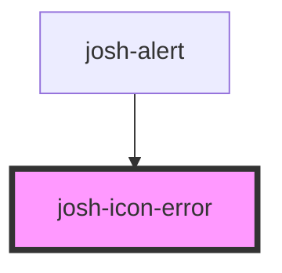

# josh-icon-checkmark

<!-- Auto Generated Below -->

## Properties

| Property | Attribute | Description | Type     | Default                      |
| -------- | --------- | ----------- | -------- | ---------------------------- |
| `color`  | `color`   |             | `string` | `'var(--black-theme-white)'` |

## Dependencies

### Used by

 - [josh-alert](../../josh-alert)

### Graph

----------------------------------------------

*Built with [StencilJS](https://stenciljs.com/)*
