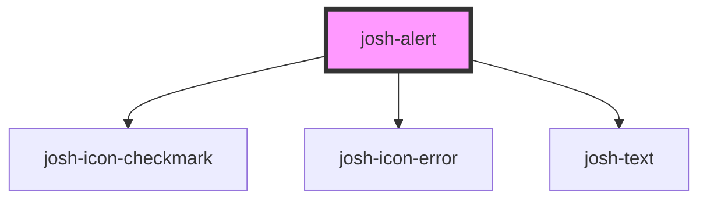

# josh-alert

<!-- Auto Generated Below -->

## Properties

| Property | Attribute | Description | Type                   | Default     |
| -------- | --------- | ----------- | ---------------------- | ----------- |
| `kind`   | `kind`    |             | `"error" \| "success"` | `undefined` |

## Dependencies

### Depends on

- [josh-icon-checkmark](../icons/josh-icon-checkmark)
- [josh-icon-error](../icons/josh-icon-error)
- [josh-text](../josh-text)

### Graph

----------------------------------------------

*Built with [StencilJS](https://stenciljs.com/)*
